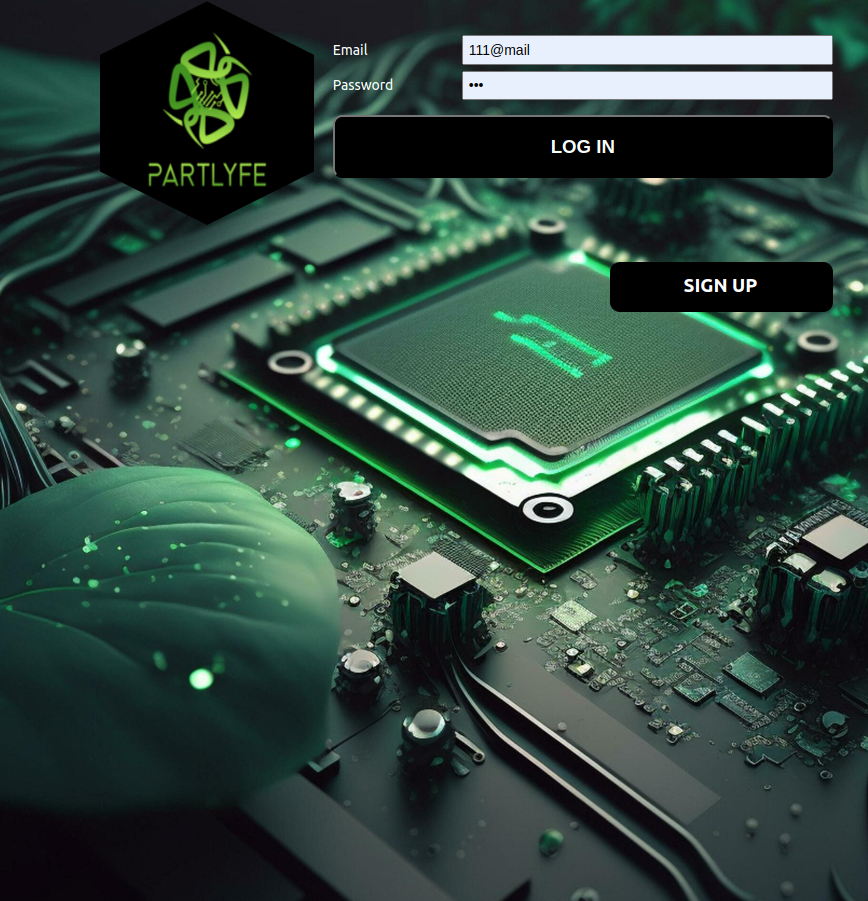
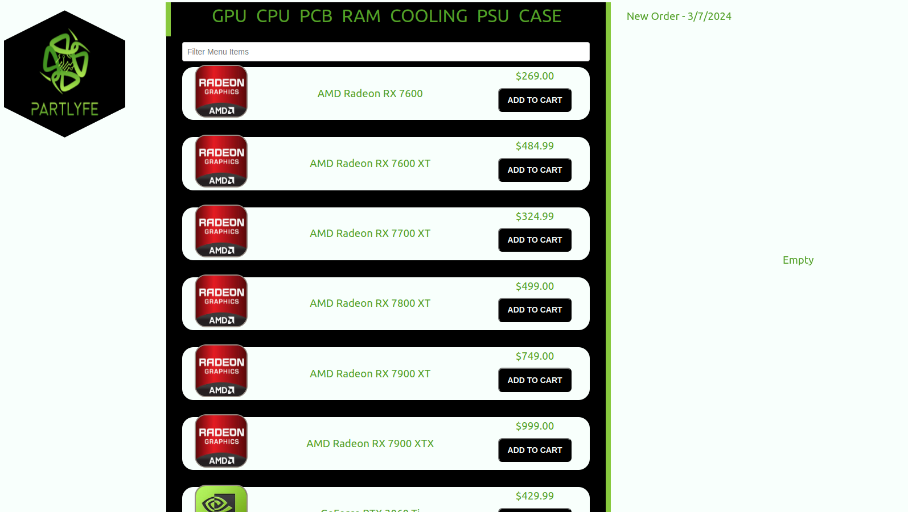
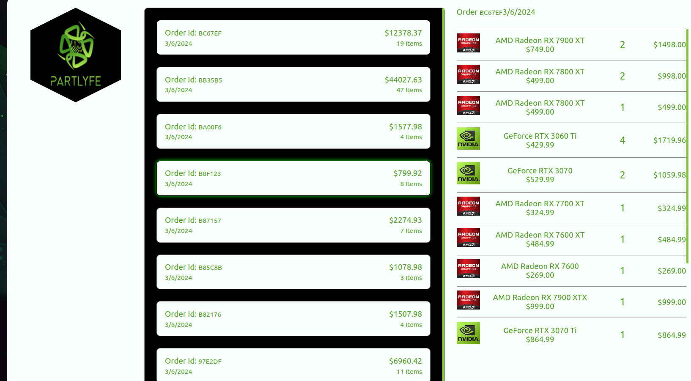
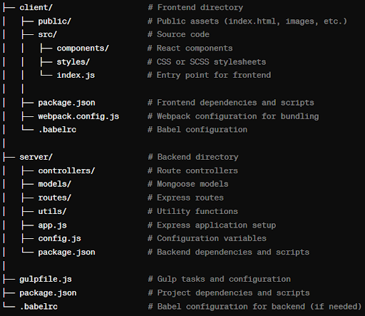

# PartLyfe 

[LiveLink](https://partlyfe.jeremycasanova.me/)

This is a Mern pc components ecommerce app that requires a user to signup and login before adding items to a users cart.  Users then may checkout items and view previous purchases as well as filter items in each category.  

# Technologies used

Github
MongoDB
VsCode
Webpack
Babbel
Gulp
Mongoose
Express
React
Node
Html
Scss
Css
Javascript

# Big Poppa Code React Starter Kit

This Starter Kit is being used in this app.
Go here to here to learn some cool stuff.
[Big Poppa Code](https://bigpoppacode.io/) ---
[Pkg Kit](https://www.npmjs.com/package/big-poppa-code-react-starter)

# Reference Materials

[React Dev](https://react.dev/)
[MDN](https://developer.mozilla.org/en-US/)
[W3Schools](https://www.w3schools.com/sass/default.asp)
[Big Poppa Code Channel](https://www.youtube.com/@bigpoppacode)
[Geeks for Geeks](https://www.geeksforgeeks.org/)
[Npm Docs](https://docs.npmjs.com/)
[Npm+runKit](https://npm.runkit.com/?q=)

# Pseudo files and folder structure

# Setup Instructions

# create .env with your mongoDB collection link/password and secret key.

# npm i (to install dependencies)

# npm run seed (to add all items from seed.js file to mongoDB)

# npm run dev(to load localhost URL)

#IceBox

Add a Library from https://www.npmjs.com/ to size up the available item list.  Create pages for each item that displays item image, specs, item, description, compatibility, price, add to cart, then have cart appear on right when item is added.  Add stripe functions to purchase items and send email for order to user email.  Increase security and add admin privileges for item edit order edit as well as standard user edit.  Add contact us page.  Add back to top button and list display option 5, 10, 20 for items on menu list.  

                                                    ----IMPORTANT----
    "THIS GIT USES BCRYPTJS AND DOES NOT USE MONGODBMEMORYSERVER IF ADDED TO MONGODB IT WILL SEND ALL FILES THERE EVERYTIME YOU RUN TESTS OR RUN SEED"

